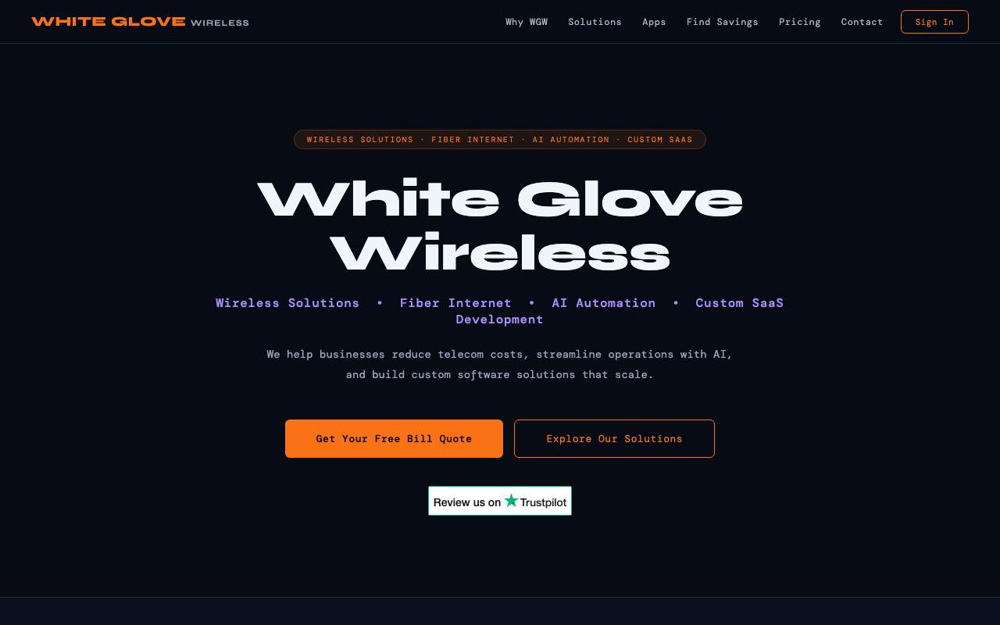
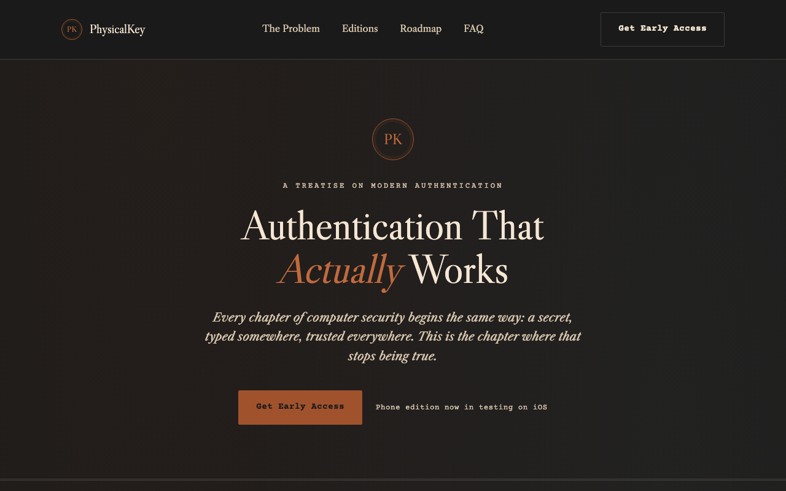
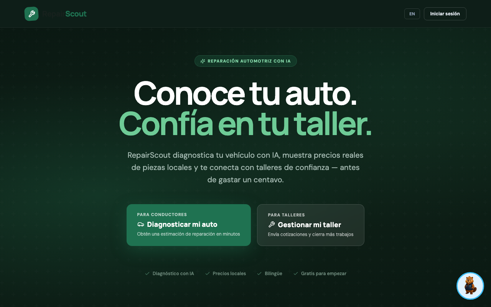
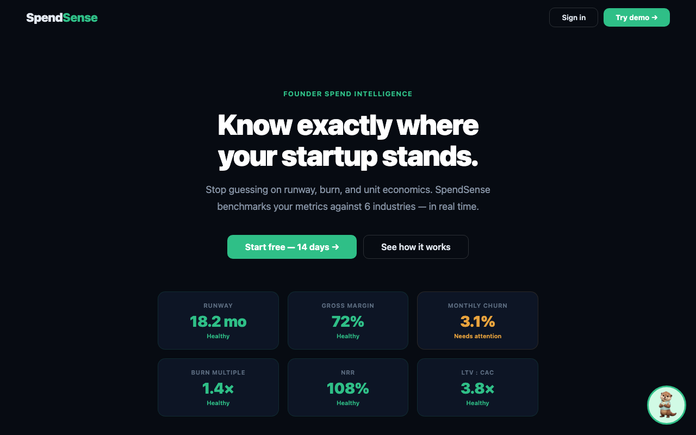
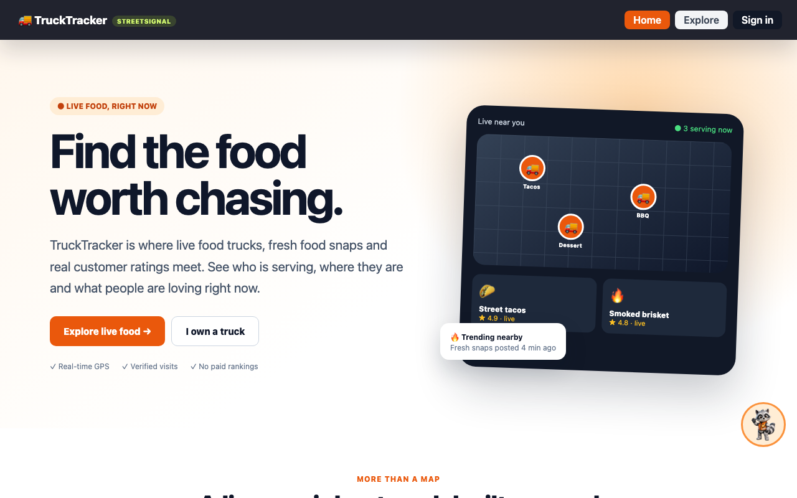
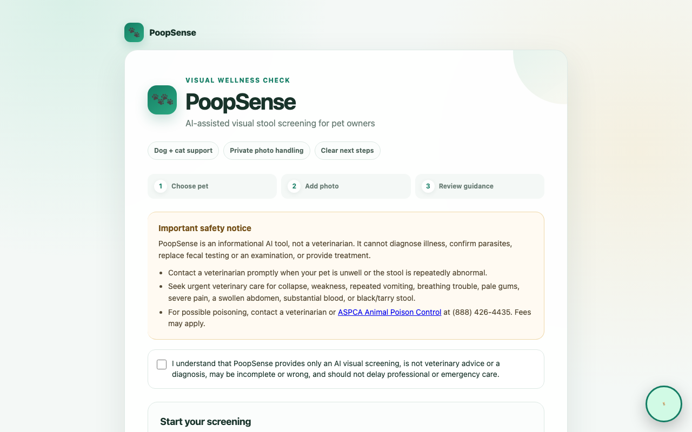
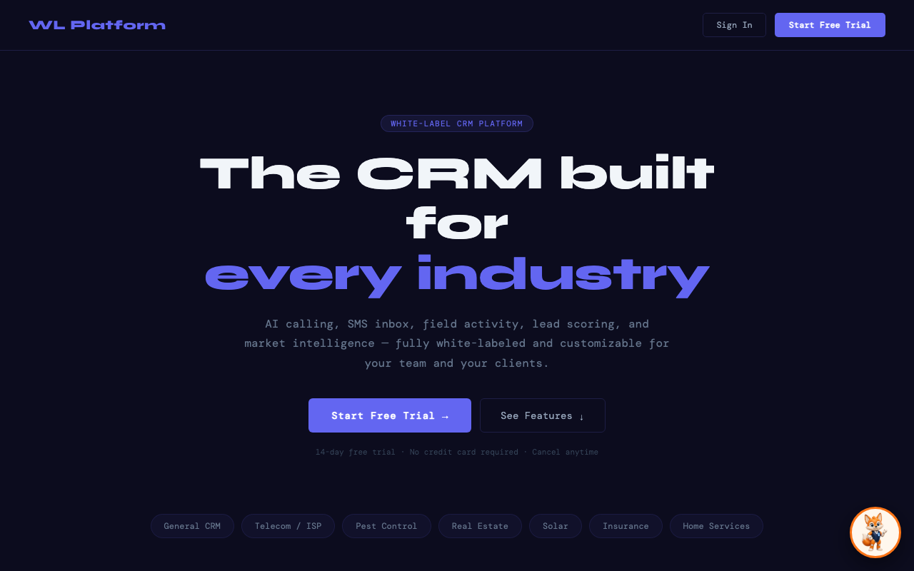
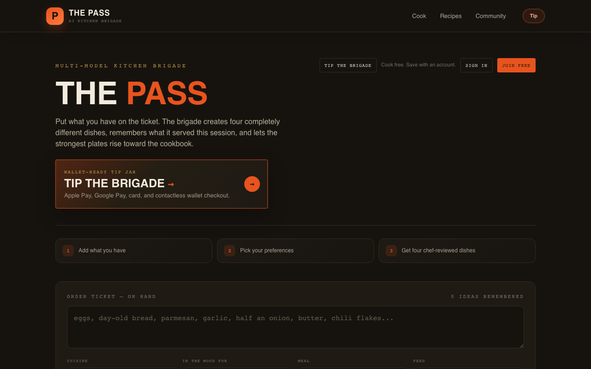

# Humberto Zepeda

### Full-Stack AI Product Engineer

**I take AI products from a blank workflow to a live system running end to end — solo, across firmware, backend, and UI.**

I build AI-enabled products from the first workflow sketch through the API, database, user interface, deployment, and operational handoff — solo, end to end, across whatever domain the problem lives in. That's ranged from sales operations and telecommunications to automotive repair, personal finance, pet health, and hardware security, because the skill I lean on most isn't a specific stack, it's figuring out how a real workflow actually works and then building the thing that fits it.

       

**[Featured work](#featured-work)** · **[More shipped work](#more-shipped-work)** · **[Core stack](#core-stack)** · **[How I work](#how-i-work)** · **[Let's talk](#lets-talk)**

## Highlights

- **A problem-solver first.** The projects below span sales ops, automotive, personal finance, pet health, hardware security, local discovery, and media production — different domains each time, same approach: learn the real workflow, then build for it.
- **Full ownership, not just a slice.** Every project here was built end to end by one person — firmware, backend, database, UI, deployment, and the operational plumbing (backups, audit logs, self-host paths) that most portfolios skip because it doesn't demo well.
- **Integrity over polish.** Projects are labeled by their actual development stage below, not their best possible pitch — see the portfolio status note. I'd rather a recruiter know exactly what's finished and what isn't than oversell either way.
- **Hard work compounds.** Shipping across this many domains, this deep into each stack, isn't a shortcut — it's a lot of hours spent actually finishing things, including the unglamorous parts.

> **Portfolio status:** The public projects below are first or early public versions. They demonstrate implemented work, but they remain in active development and should not be interpreted as finished products.

## Featured work

<table>
<tr>
<td width="55%" valign="top">

### 🛰️ White Glove Wireless
**AI sales operations platform**

A production-oriented platform for lead management, territory operations, AI-assisted calling, messaging, onboarding, analytics, billing, and role-based workflows.

`React` `Node.js` `Express` `PostgreSQL` `Supabase` `Twilio` `Telnyx` `Stripe`

- Multi-tenant authorization, operational dashboards, assignment workflows
- Audit and compliance controls across the whole workflow
- Live product · no login required to see the landing

**[Live product](https://white-glove-frontend.vercel.app) · [Product site](https://whitegwireless.com)**

_The primary application repositories are private — proprietary product implementation._

</td>
<td width="45%">

</td>
</tr>
</table>

<table>
<tr>
<td width="55%" valign="top">

### 🔑 PhysicalKey
**BLE hardware security platform**

An ESP32-based key fob paired to a native iOS app over Bluetooth, with a backend that enforces per-device cryptographic trust — phone, biometric, and physical key as three independent proofs, not one copyable secret.

`ESP-IDF/NimBLE` `Swift/iOS` `Node.js` `Stripe`

- Per-unit passkey BLE pairing (not Just Works), Ed25519 device signing, flash + NVS encryption
- Phone identity is Secure-Enclave-resident P-256
- Scheduled backups, health checks, and a documented self-host path
- Verified end to end on physical hardware: real phone-to-device pairing, GATT read/write, independently-verified cryptographic signatures

**[Public repository](https://github.com/humbertowgw-maker/physicalkey-core) · [Product site](https://physicalkey.whitegwireless.com) · [Case study →](case-studies/physicalkey.md)**

</td>
<td width="45%">

</td>
</tr>
</table>

<table>
<tr>
<td width="55%" valign="top">

### 🔧 RepairScout
**AI-assisted automotive repair platform**

A two-sided workflow where drivers research vehicle problems and repair shops verify diagnoses, create estimates, communicate with customers, and manage repair stages.

`React` `Express` `PostgreSQL` `NHTSA API`

- AI diagnosis with real local part pricing before a driver spends a cent
- Shop-side quoting, job management, and customer messaging
- Bilingual interface (English/Spanish)

**[Live demo](https://repairscout-smoky.vercel.app) · [Public repository](https://github.com/humbertowgw-maker/repairscout)**

</td>
<td width="45%">

</td>
</tr>
</table>

<table>
<tr>
<td width="100%" valign="top">

### 🧠 Personal BrainOS
**Private local-first AI operating system**

A personalized Jarvis-style system with local inference, durable memory, bounded specialist agents, telecommunications, infrastructure awareness, reminders, self-coding worktrees, and owner approval gates — running on a self-hosted, multi-node homelab rather than a public cloud.

`Python` `FastAPI` `React` `Docker Compose` `PostgreSQL` `Qdrant` `Ollama` `Tailscale`

_Private and self-hosted by design — no public demo, which is the point: it's infrastructure I run, not a product I ship._

</td>
</tr>
</table>

## More shipped work

<table>
<tr>
<td width="33%" valign="top">
 
<b>SpendSense</b> 
Runway, burn, and unit-economics benchmarking for founders, live against 6 industries. 
React · Stripe-style metrics UI 
<a href="https://spendsense-seven.vercel.app">Live demo →</a>
</td>
<td width="33%" valign="top">
 
<b>TruckTracker</b> 
Live food-truck discovery: real-time GPS, verified visits, community ratings, no paid rankings. 
React · maps · real-time data 
<a href="https://trucktracker-eight.vercel.app">Live demo →</a>
</td>
<td width="33%" valign="top">
 
<b>PoopSense</b> 
Safety-bounded AI visual screening for pet stool health, with explicit vet-escalation guidance built in. 
AI vision · safety-first UX 
<a href="https://web-production-fb2d1.up.railway.app">Live demo →</a>
</td>
</tr>
<tr>
<td width="33%" valign="top">
 
<b>White-label AI Sales Platform</b> 
Configurable CRM with AI calling, SMS inbox, lead scoring, and market intelligence — white-labeled per client. 
Active-development preview, roughly halfway built 
<a href="https://salesplatform-frontend.vercel.app">Live preview →</a>
</td>
<td width="33%" valign="top">
 
<b>The Pass</b> 
Multi-model AI "kitchen brigade": Groq proposes dishes from what's on hand, OpenAI and Anthropic review them in parallel. 
Multi-provider AI orchestration 
<a href="https://purple-beach-0c1e8a510.7.azurestaticapps.net">Live demo →</a>
</td>
<td width="33%" valign="top">
 
<b>Different Friends Pipeline</b> 
Bilingual media-production workflow with distributed workers and human review gates. 
Distributed workers · review gates 
<i>Private repository, no public demo</i>
</td>
</tr>
<tr>
<td width="33%" valign="top">
 
<b>friendlyfriends</b> 
An AI-provider cost/routing dashboard bolted onto a from-scratch animated-episode pipeline for a real cast of pets — built on a zero-paid-API-key constraint (free image gen, free TTS, FFmpeg). 
Node.js · React · SQLite (WASM) · free-tier media pipeline 
<a href="https://github.com/humbertowgw-maker/friendlyfriends">Public repository</a> · <a href="case-studies/friendlyfriends.md">Case study →</a>
</td>
</tr>
</table>

## Core stack

**Frontend:** React, Next.js, Vite, responsive product interfaces
**Backend:** Node.js, Express, Python, FastAPI, Flask
**Data:** PostgreSQL, Supabase, Neon, Qdrant, Redis
**Applied AI:** Ollama, model APIs, vision, voice, agents, retrieval and tool execution
**Embedded/Hardware:** ESP-IDF, BLE (NimBLE), C/C++, Swift/iOS
**Integrations:** Twilio, Telnyx, Stripe, Clerk, Resend, Google APIs, NHTSA
**Operations:** Docker, Railway, Vercel, Tailscale, Linux, CI workflows, self-hosted infrastructure

## How I work

- Translate operational problems into working software quickly.
- Build across frontend, backend, data, integrations and deployment.
- Keep consequential AI actions bounded by consent, approvals and audit history.
- Validate with real builds, live endpoints and user-visible receipts.
- Use AI-assisted development while retaining responsibility for architecture, verification and production behavior.

## Let's talk

**Roles I'm interested in:** AI Product Engineer · Forward Deployed AI Engineer — also open to Full-Stack AI Engineer, AI Solutions Engineer, and Technical Solutions Engineer roles.

**[whitegwireless.com](https://whitegwireless.com)** · open to conversations — see any live product above for a working example of how I build.
